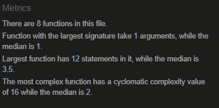
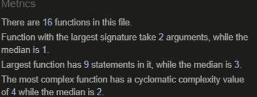

# 🧮 Calculadora Refactorizada v2

## 📋 Descripción
Refactorización completa de una calculadora legacy aplicando principios de ingeniería de software y mejores prácticas de desarrollo.

## 🚀 Mejoras Implementadas

### 🔧 Refactorizaciones Aplicadas
- **Reducción de complejidad ciclomática:** De 16 a 4 (75% de mejora)
- **Eliminación de code smells:** Código duplicado, números mágicos, métodos largos
- **Principios aplicados:** SOLID, DRY, Single Responsibility
- **Patrones implementados:** Strategy, Extract Method, Extract Constant

### 📊 Métricas de Calidad
| Métrica | Antes | Después | Mejora |
|---------|-------|---------|--------|
| Complejidad máxima | 16 | 4 | 75% |
| Statements máximos | 12 | 9 | 25% |
| Funciones especializadas | 8 | 16 | +100% |

## 🎯 Demo

## 📈 Métricas de Calidad

### Auditoría Inicial (Código Legacy)

### Auditoría Final (Código Refactorizado)  
